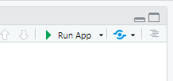
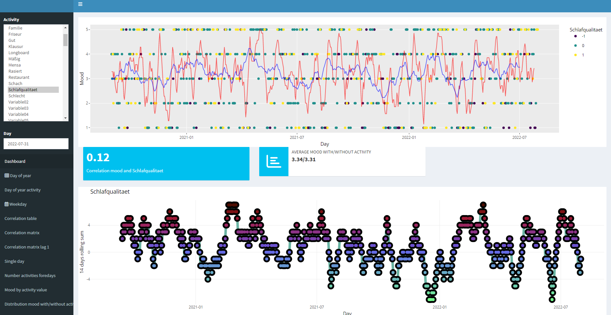
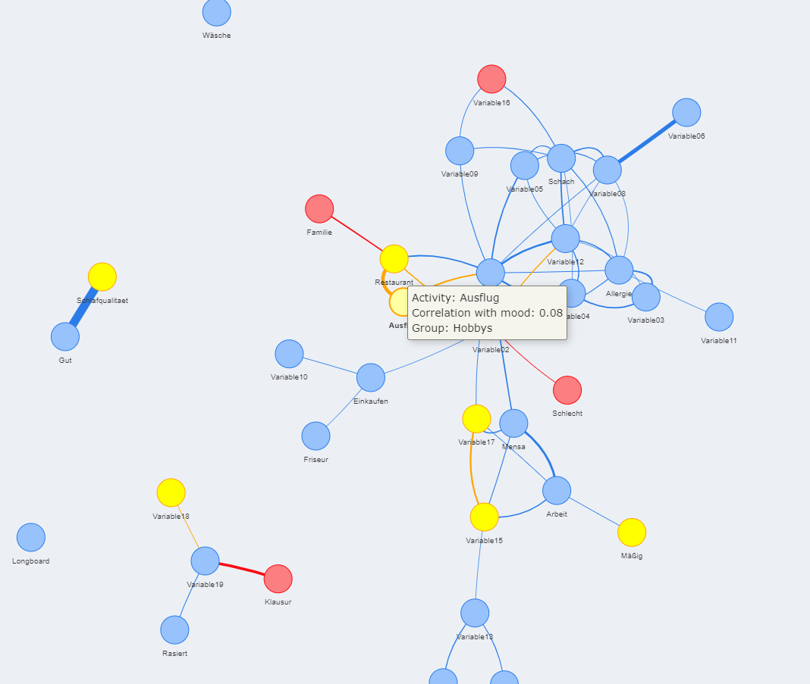
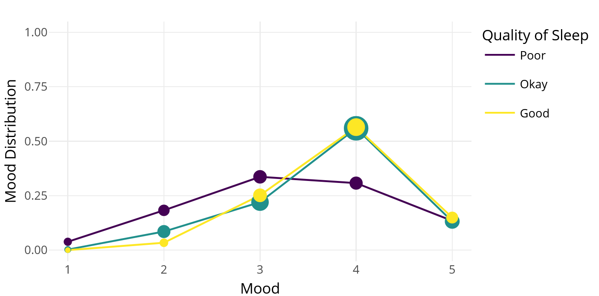
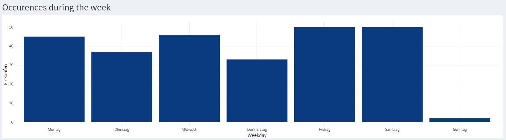
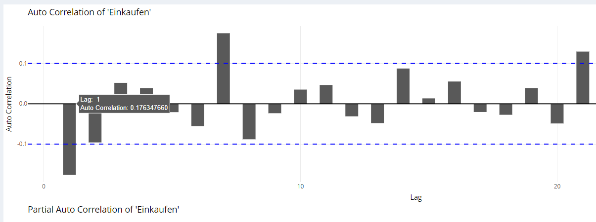
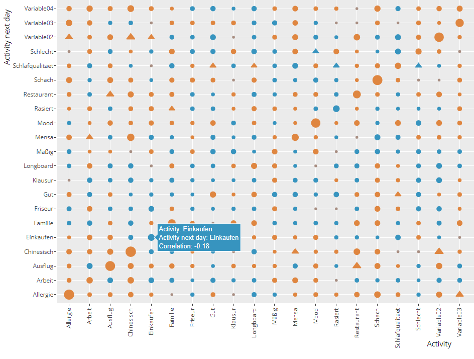
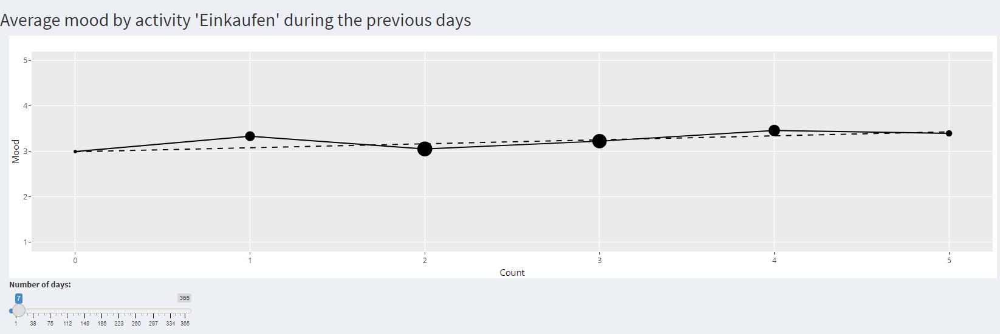

# Daylio
This repository contains a Shiny dashboard with the purpose of data analysis and visualization for data collected with the app [Daylio](https://daylio.net/).

## Getting Started

 - In case you do not bring your own data, skip this step and use the provided mock data. Otherwise export your data from the Daylio app to the folder ./data.
 - Copy config_template.yaml and rename it config.yaml.
 - Edit the file name of your data in config.yaml. Do not specify the path or the .csv file extension. Note that the data needs to be in the exact format from the Daylio app: It must contain the columns `full_date`, `weekday`, `mood`, `activities` which contains all the activities for the day, separated by " | ", and `note`. Other columns are ignored.
 - Start the app by opening any of the files global.R, server.R or ui.R in RStudio (Posit) and press "Run App" on the top right in the source box.

 
Note that exactly one entry per day and no missing values are assumed. The app might not be working as expected if these assumption are not true.

## Examples

The app contains many different kinds of visualizations. Here are a selected few examples. Note that all data is anonymized for privacy reasons.

## Contributing

Anyone interested is invited to contribute via pull requests.
